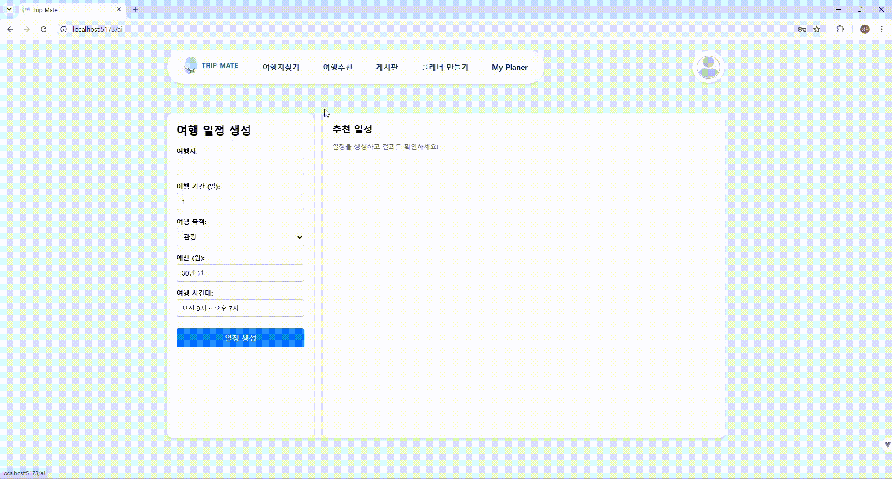

# TripMate

# 📌 프로젝트 소개  
TripMate는 여행 준비와 일정을 관리하는 과정을 효율적이고 편리하게 만들어주는 통합 여행 관리 플랫폼입니다

## 📑 주요 기능

### 1. 여행 정보 제공  
공공 데이터 API를 활용하여 관광지, 숙박시설, 음식점 등 여행에 필요한 정보를 제공합니다. 사용자는 간단한 검색만으로 목적지에 대한 다양한 정보를 손쉽게 확인할 수 있습니다.

### 2. 일정 관리 및 공유  
**Day별 플래너** 기능을 통해 사용자는 세부적인 여행 일정을 체계적으로 관리할 수 있습니다. 또한, 자신이 계획한 일정을 다른 사람들과 공유하고 의견을 주고받으며 여행 계획을 더욱 발전시킬 수 있습니다.

### 3. AI 기반 일정 생성 및 경로 추천  
여행 지역, 기간, 예산 등의 데이터를 입력하면, 사용자의 선호도와 조건을 기반으로 최적화된 일정과 이동 경로를 자동으로 제안합니다.

### 4. 커뮤니티  
여행자들이 자유롭게 정보를 나누고, 경험을 공유할 수 있는 **게시판** 기능을 제공합니다. 다른 사용자의 유용한 팁을 참고하거나 자신의 여행 정보를 공유할 수 있습니다.

# 🧱 아키텍처

# 📈 ERD

# 🙈 기능 엿보기(GIF)

## 여행 일정 관리

## 여행 일정 공유

## 여행 일정 추천

## 지역별, 카테고리별 관광지 검색

## 게시판 보기 및 작성

## 회원가입 및 로그인

